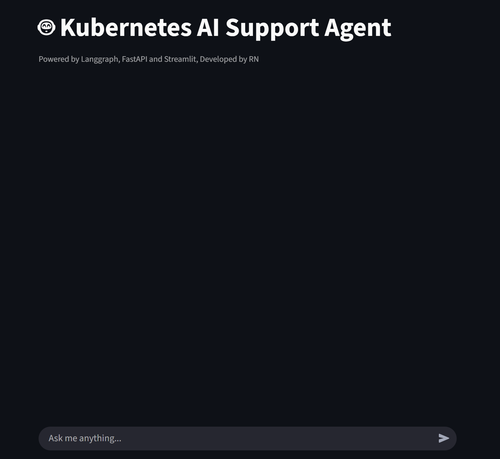
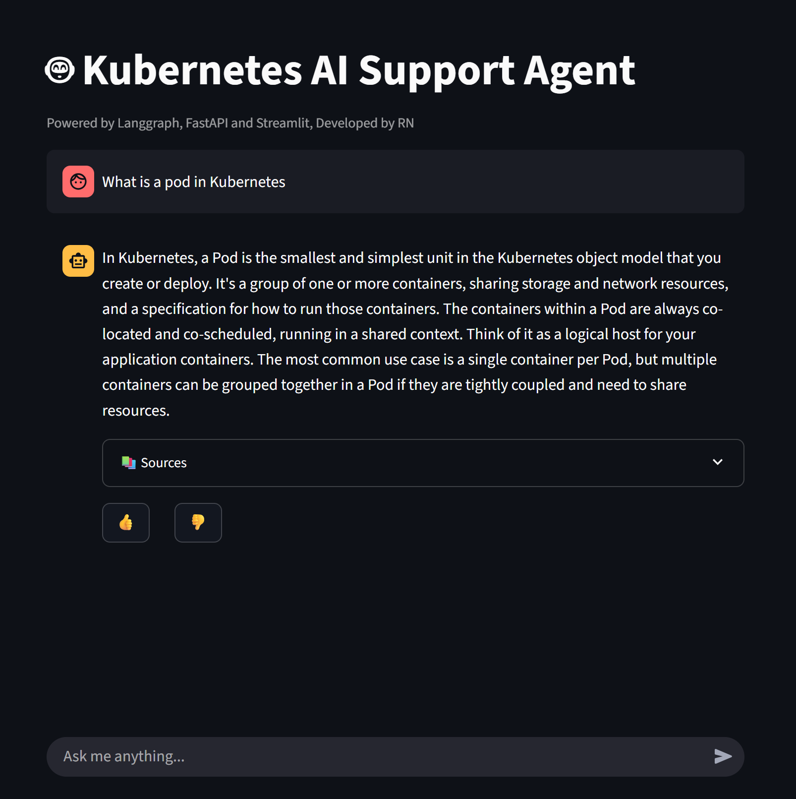
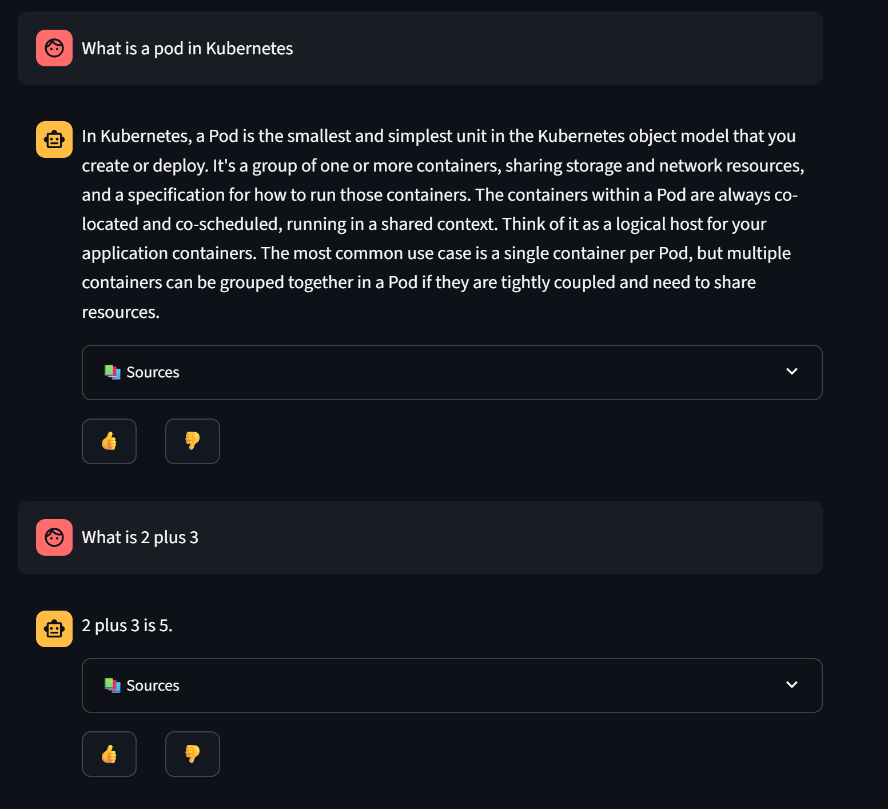
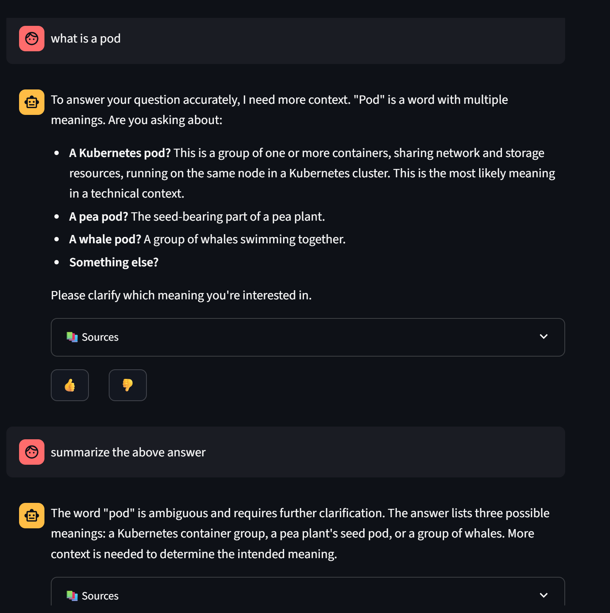
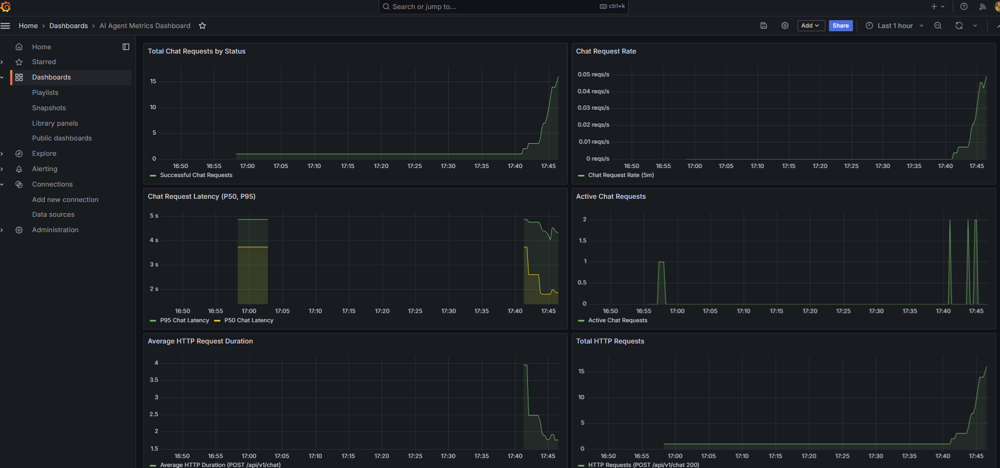
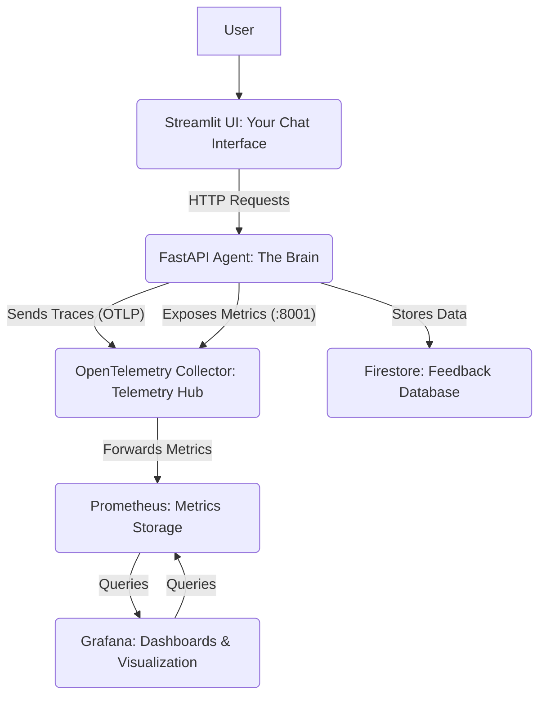

# KUBERNETES AI Support Agent Application: Comprehensive Documentation

This document provides a complete guide to understanding, setting up, and operating our intelligent conversational agent that answers Kubernetes related queries with access to Calculator tool and Weather data. 

## 1. Introduction to the KUBERNETES AI Support Agent

This application is designed to act as a smart conversational agent, capable of answering user queries by retrieving information from a knowledge base (**RAG - Retrieval-Augmented Generation**) and performing actions through integrated **tools**. Beyond its core AI capabilities, I have prioritized **observability**, allowing us to monitor its performance, track user satisfaction, and quickly troubleshoot any issues.

Think of it as a helpful assistant that can look up facts, do calculations, check the weather, and continuously learn from user feedback, all while providing insights into its own operational health.


### CHATBOT WORKING

*Chatbot Responses with asking for clarification when needed*

<table>
  <tr>
    <td>
      
    </td>
    <td>
      
    </td>
  </tr>
  <tr>
    <td>
      
    </td>
    <td>
      
    </td>
  </tr>
</table>

*Grafana Dashboard with various metrics*




## 2. Architecture: How It All Fits Together

Our AI Support Agent is built as a set of interconnected services, each running in its own Docker container. This modular approach makes the system robust, scalable, and easy to manage using Docker Compose.

Here’s a simplified view of how the different parts communicate:


### Breaking Down the Components:

* **Streamlit UI (`ui_service`):** This is what you see – the interactive **chat window** in your web browser. It's built with **Streamlit** and acts as the user's direct point of contact with the AI. It sends your questions to the FastAPI Agent and displays the AI's responses, including any **sources** it used.

* **FastAPI Agent (`agent_service`):** This is the **core intelligence**. It's a Python backend built with **FastAPI** that:
    * Receives your chat messages.
    * Uses **LangGraph** to orchestrate the AI's thought process, deciding whether to retrieve information, use a tool, or respond directly.
    * Integrates a **RAG (Retrieval-Augmented Generation) pipeline** to fetch relevant documents from a **knowledge base** (powered by FAISS) before generating a response.
    * Can call external **Tools** like a `calculator` or a `weather` service if your query requires it.
    * **Monitors itself:** It exposes its own **performance metrics** (like how many chat requests it handles, how long they take, and any errors) for **Prometheus** to collect.
    * **Traces its operations:** It sends detailed **operational traces** to the **OpenTelemetry Collector**, allowing us to see the flow of a request through the system.
    * Handles user **feedback** (👍/👎) and stores it in **Firestore**.

* **OpenTelemetry Collector (`otel-collector`):** This acts as our **central telemetry hub**. It's like a post office for monitoring data:
    * It receives **traces** from the FastAPI Agent.
    * It actively **scrapes** (pulls) **metrics** from the FastAPI Agent's dedicated metrics port.
    * It then processes and forwards these metrics in a format that Prometheus understands.

* **Prometheus (`prometheus`):** Our **time-series database for metrics**. It's configured to:
    * **Scrape** the processed metrics from the OpenTelemetry Collector.
    * **Store** this historical performance data.

* **Grafana (`grafana`):** Our **visualization powerhouse**. It connects to Prometheus to:
    * **Pull** the stored metrics.
    * **Display** them in intuitive, real-time **dashboards**, giving us a clear picture of the application's health and performance.

* **Firestore:** A highly scalable, cloud-based **NoSQL cloud database**. This is where all the valuable user **feedback** (like/dislike) is securely stored for later analysis.

## 3. Project Folder Structure

Understanding the project layout helps in navigating and managing the codebase.

```mermaid
.
├── agent_service/
│   ├── app/
│   │   ├── api/
│   │   │   └── v1/
│   │   │       └── agent_api.py      # FastAPI endpoints for chat and feedback
│   │   ├── agent/
│   │   │   └── core.py               # LangGraph agent logic, RAG, tool execution
│   │   ├── config/
│   │   │   └── settings.py           # Application settings (e.g., API keys)
│   │   ├── observability/
│   │   │   ├── feedback.py           # Firestore integration for feedback
│   │   │   ├── logging_config.py     # Centralized logging setup
│   │   │   ├── metrics.py            # All Prometheus metric definitions
│   │   │   └── tracing.py            # OpenTelemetry tracing setup
│   │   ├── rag/
│   │   │   ├── embeddings.py         # Embeddings model generation
│   │   │   └── vector_db.py          # FAISS vector database management
│   │   └── main.py                   # Main FastAPI application entry point
│   ├── data/                         # RAG knowledge base files (if any)
│   ├── faiss_index.bin               # Pre-built FAISS index for RAG
│   ├── faiss_index.bin_docstore.pkl  # Docstore for FAISS index
│   ├── Dockerfile                    # Dockerfile for building the agent_service image
│   └── requirements.txt              # Python dependencies for agent_service
├── grafana_provisioning/
│   ├── dashboards/                   # Grafana dashboard JSON files (can be used for provisioning)
│   └── datasources/                  # Grafana datasource configuration (e.g., Prometheus)
├── ui_service/
│   ├── app/
│   │   └── app.py                    # Streamlit UI application
│   └── Dockerfile                    # Dockerfile for building the ui_service image
├── .env                              # Environment variables (e.g., API keys)
├── docker-compose.yml                # Defines and orchestrates all Docker services
├── otel-collector-config.yml         # OpenTelemetry Collector configuration
└── prometheus.yml                    # Prometheus configuration

```

## 4. Setup Guide: Getting Started

Follow these steps to deploy and run the AI Support Agent on your local machine.

### 4.1. Prerequisites

Before you begin, ensure you have the following software installed on your system:

* **Docker Desktop:** This includes Docker Engine and Docker Compose, essential for running our containerized services.
    * [Download Docker Desktop](https://www.docker.com/products/docker-desktop/)
* **Git:** Used to clone the project repository.
    * [Download Git](https://git-scm.com/downloads/)
* **Google Gemini API Key:** This is crucial for the AI agent's core functionality.
    * [Get a Gemini API Key](https://ai.google.dev/)
* **Firebase Project (Optional but Recommended for Feedback):** If you want the feedback mechanism to store data in a real Firestore instance, you'll need:
    * A Google Cloud Project with Firestore enabled.
    * A Firebase **Service Account Key JSON file** for your project. This file grants your backend service permission to write to Firestore.

### 4.2. Clone the Repository

First, clone the project repository to your local machine:

```bash
git clone <repository_url>
cd <repository_directory> # Navigate into the cloned project folder
```

### 4.3. Configure Environment Variables (`.env`)

In the **root directory** of your project (where `docker-compose.yml` is located), create a file named `.env`. This file will hold **sensitive information** like API keys.

Add your **Gemini API Key** to this file:

```dotenv
GEMINI_API_KEY="YOUR_GEMINI_API_KEY_HERE"
```

### 4.4. Data Preparation (FAISS Index)**

The RAG component relies on pre-built **FAISS index files**. You must ensure that both `faiss_index.bin` and `faiss_index.bin_docstore.pkl` are present in your `agent_service/` directory.

These files represent your application's **knowledge base**. If they are missing, the RAG functionality will not work, and the agent will rely solely on its general LLM capabilities and any other configured tools.


### **4.5. Build and Run the Application**

Now you're ready to build your Docker images and launch all services. From your project's root directory, run the following commands in your terminal.

---

### **Perform a clean shutdown and remove old data/containers:**

1. This is a crucial step, especially after making changes to `requirements.txt` or `Dockerfiles`, as it ensures a fresh build.

```bash
docker-compose down -v
```
### **Build and Run Services**

**Build images and start all services in detached mode:**

1. Run the following command from your terminal:

```bash
docker-compose up --build -d
```
**Note:** The `--build` flag is essential. It forces Docker to rebuild the service images (specifically `agent_service`), which guarantees that any new dependencies, such as `firebase-admin`, are properly installed. The `-d` flag runs the containers in the background, freeing up your terminal.


### **5. Running the Application**

Once `docker-compose up --build -d` completes successfully, all your services will be running. You can access them using your web browser via the following links:

* **AI Support Agent UI (Streamlit):** Access the agent's interactive interface at **`http://localhost:8501`**.
* **FastAPI Agent API:** You can verify the backend is running by checking the health endpoint at **`http://localhost:8000/health`**.
* **FastAPI Agent Metrics:** View the raw Prometheus metrics for the agent at **`http://localhost:8001/metrics`**.
* **Prometheus UI:** Access the Prometheus monitoring dashboard at **`http://localhost:9090`**.
* **Grafana UI:** Access the Grafana dashboards at **`http://localhost:3000`**. The default login is `admin/admin`, and you will be prompted to change it on your first visit.


### **6. Monitoring & Observability**

This application is equipped with comprehensive observability features. Here is how you can verify and use them.

### **6.1. Verifying Metrics in Prometheus**

1.  Open your web browser and go to **`http://localhost:9090`**.
2.  Navigate to **Status -> Targets**. You should see `otel-collector:8889/metrics` listed with a **`UP`** status. This confirms that Prometheus is successfully collecting metrics from the OpenTelemetry Collector.
3.  Go to the **Graph** tab. You can now query for various metrics, such as:
    * `chat_requests_total`
    * `http_requests_total`
    * `chat_errors_total`
    * `rag_retrieval_duration_seconds_count`
    * `tool_calls_total`
    * `chat_active_requests`

 ### **6.2. Visualizing Metrics in Grafana**

1.  Open your web browser and navigate to **`http://localhost:3000`**.
2.  Log in with the default credentials: **`admin/admin`**. You will be prompted to change your password.
3.  **Ensure Prometheus Data Source is Configured:**
    * From the left-hand menu, go to **Connections -> Data sources**.
    * Verify that a **"Prometheus"** data source is listed and shows a `working` status.
    * If it's not present, click **Add new data source**, select **Prometheus**, and set the URL to **`http://prometheus:9090`** (this is the Docker internal network address for the Prometheus container).
    * Click **Save & test**.
4.  **Import the AI Agent Metrics Dashboard:**
    * From the left-hand menu, go to **Dashboards -> New -> Import**.
    * Paste the entire JSON content for the Grafana Dashboard into the **"Import via panel json"** text area. (You will need to obtain this JSON content separately.)
    * Click **Load**.
    * On the next screen, you can rename the dashboard if you wish. For the "Prometheus" data source, select the Prometheus data source you configured in the previous step.
    * Click **Import**.

You should now see a rich dashboard displaying real-time and historical metrics for your AI Support Agent. You can interact with the Streamlit UI to generate traffic and watch the graphs populate!   

### **6.3. Grafana Dashboard JSON**

This JSON defines a comprehensive dashboard with panels for all the custom metrics collected from your **AI Agent**. You will use this JSON content to import the dashboard into Grafana.

---

> **Note:** The full JSON content for the dashboard is not provided here. You will typically find this in a separate file (e.g., `grafana_plots_script.txt`) within the project repository. You will need to copy the entire contents of that file and paste it into the "Import via panel json" text area in Grafana.


### **7. IMAGES OF CHATBOT WORKING**

*Chatbot Responses with asking for clarification when needed*

<table>
  <tr>
    <td>
      
    </td>
    <td>
      
    </td>
  </tr>
  <tr>
    <td>
      
    </td>
    <td>
      
    </td>
  </tr>
</table>

*Grafana Dashboard with various metrics*


